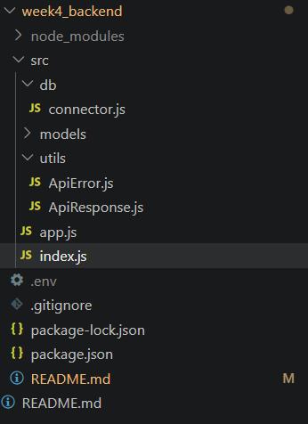
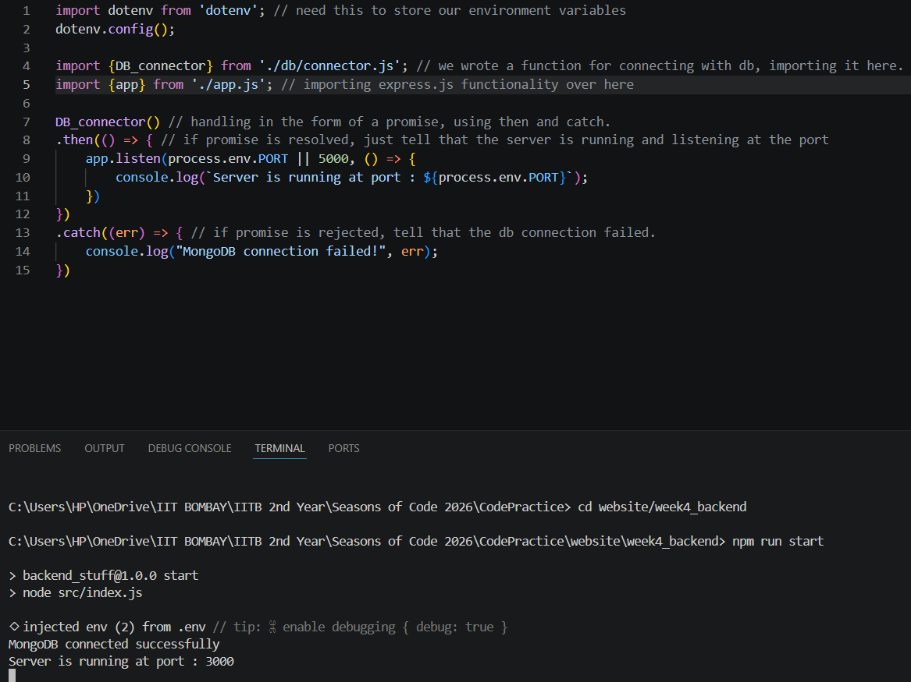
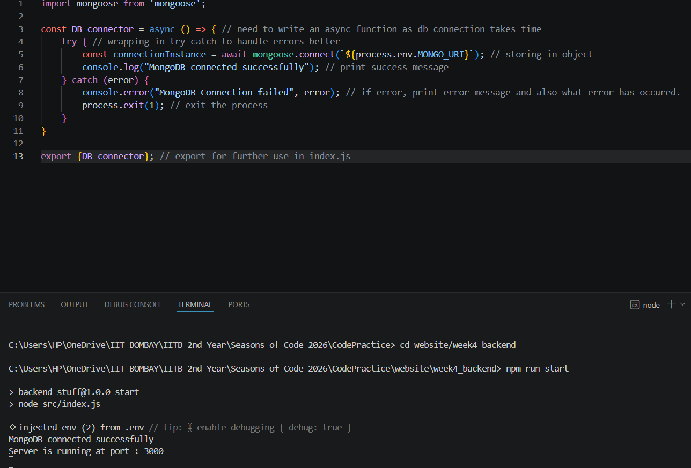
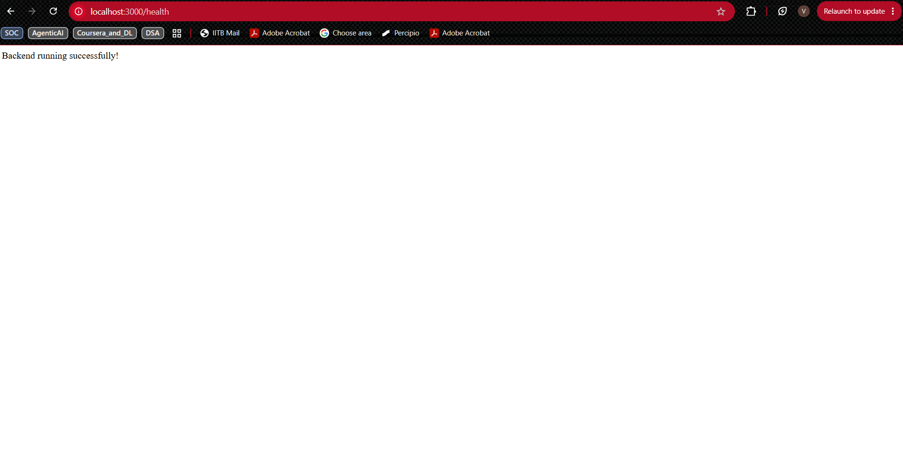
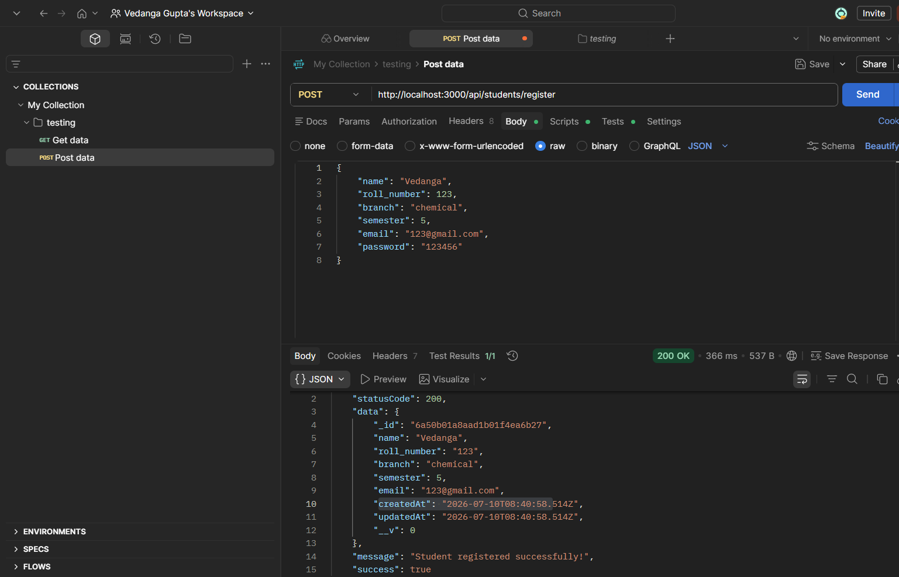
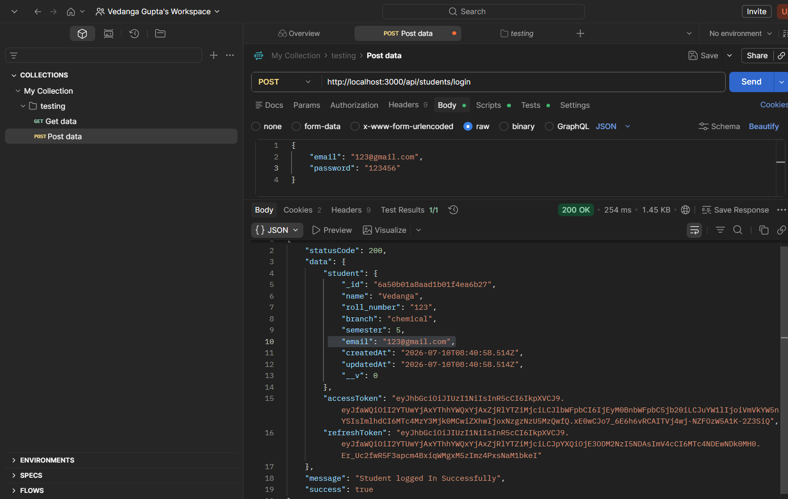
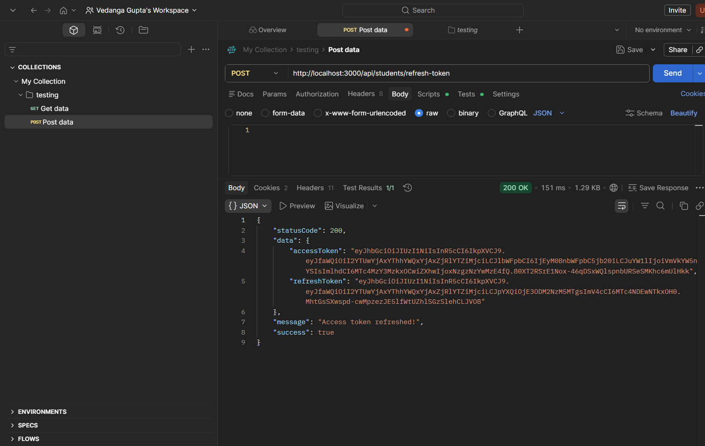
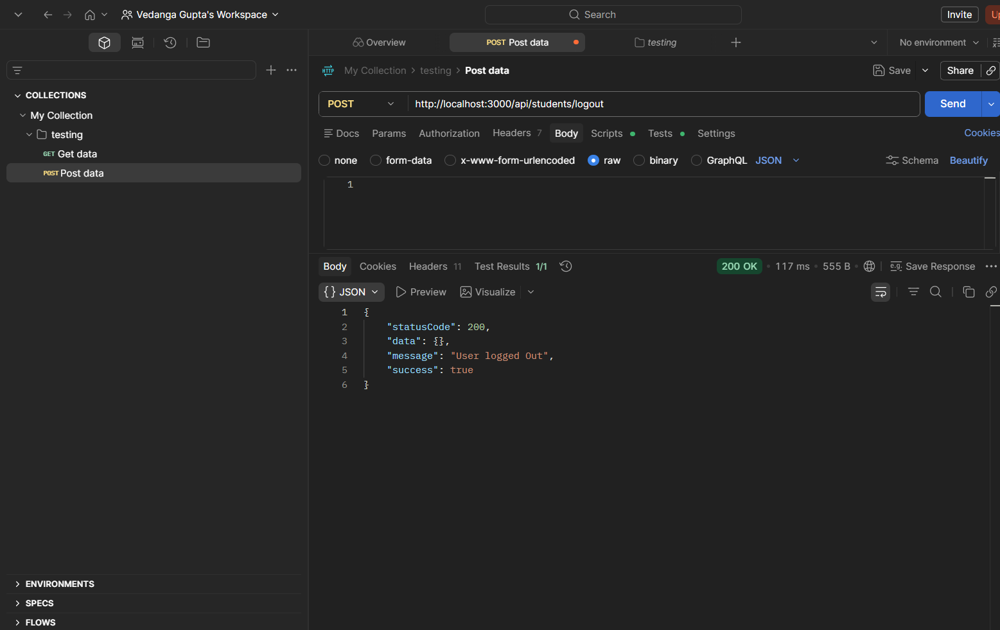
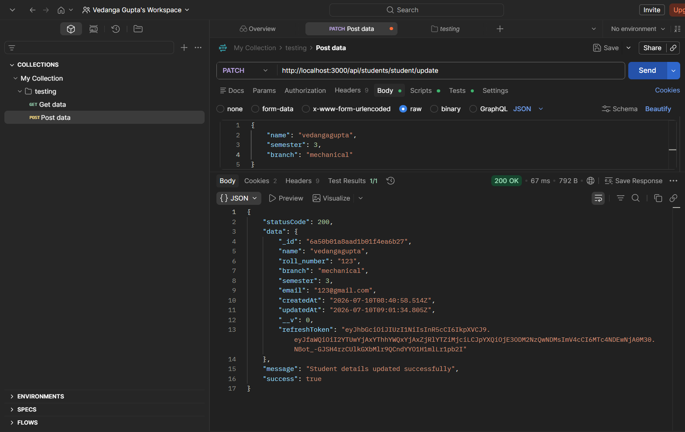
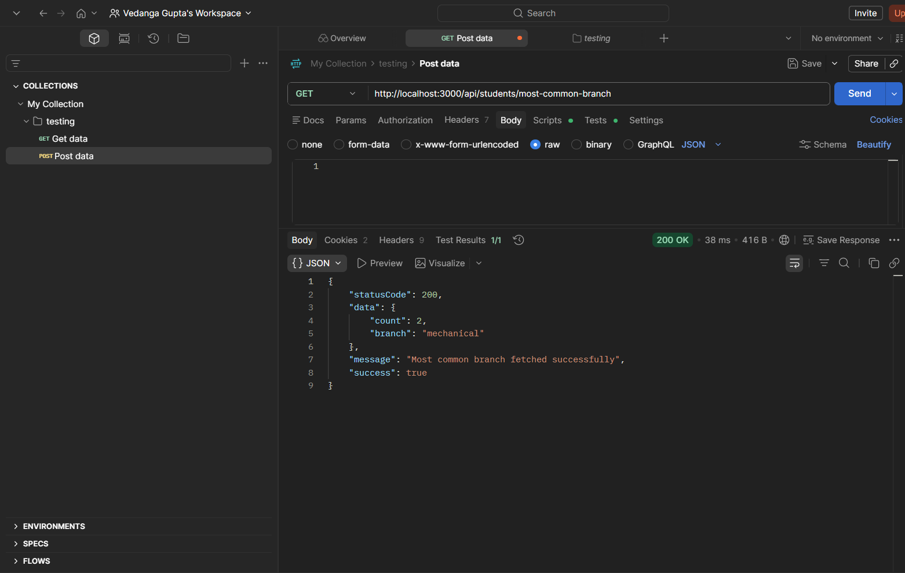

# Week 4 and 5: Full Backend

## Week 4: Introduction to Backend.

This mini project features a clean architectural structure, MongoDB integration via Mongoose, custom API response/error handling, and simple data modeling for a student management system.

## 🚀 Tech Stack
* **Runtime:** Node.js
* **Framework:** Express.js
* **Database:** MongoDB
* **ODM:** Mongoose
* **Environment Management:** dotenv

## 📁 Folder Structure
The project follows a clean, modular architecture to ensure scalability and separation of concerns:

```text
src/
├── db/             # Database connection logic
├── models/         # Mongoose schema (Student model)
├── utils/          # Utility classes for custom API responses and errors
├── app.js          # Express app configuration and HTTP endpoints
└── index.js        # Main entry point and server initialization
```

## ✨ Key Features
* **Structured Database Connection:** Secure MongoDB connection using environment variables, complete with error handling and success logging (`MongoDB connected successfully`).
* **Data Modeling:** A comprehensive `Student` schema featuring validation and timestamps for tracking `Name`, `Roll Number`, `Branch`, `Semester`, and `Email`.
* **Standardized API Responses:** Utilizes custom `ApiResponse` and `ApiError` utility classes to ensure every endpoint returns a consistent, predictable JSON structure.

---

## 🛠️ Local Setup & Installation

Follow these steps to get the server running on your local machine.

### 1. Prerequisites
Ensure you have the following installed:
* [Node.js](https://nodejs.org/) (v14 or higher recommended)
* A MongoDB database (either a local MongoDB Community Server or a MongoDB Atlas cloud cluster)

### 2. Install Dependencies
Clone your repository (if applicable) and install the required Node packages:
```bash
# Navigate to the project directory
cd your-project-folder

# Install dependencies (Express, Mongoose, dotenv)
npm install
```

### 3. Environment Variables
Create a file named `.env` in the root directory of your project. Add your MongoDB connection string and preferred port. 

**DO NOT commit this file to GitHub.** (Ensure `.env` is in your `.gitignore`).

```env
PORT=8000
MONGO_URI=mongodb+srv://<username>:<password>@cluster0.mongodb.net/student_db?retryWrites=true&w=majority
```
*(Note: Replace the `MONGO_URI` with your actual Atlas string or `mongodb://127.0.0.1:27017/student_db` if running locally).*

### 4. Start the Server
Run the application using Node:
```bash
node src/index.js
```
If everything is configured correctly, your terminal should output:
```text
Server is running on port 8000
MongoDB connected successfully
```

---

## 📡 API Documentation

### 1. Health Check
Verifies that the backend is active and listening for requests.

* **URL:** `/health`
* **Method:** `GET`
* **Success Response:**
  * **Content:**
    ```json
    {
      "message": "Backend running successfully"
    }
    ```

### 2. Create Student
Accepts student data and provisions a new document in the database.

* **URL:** `/student`
* **Method:** `POST`
* **Body (JSON):**
  ```json
  {
    "name": "John Doe",
    "rollNumber": "101234",
    "branch": "Computer Science",
    "semester": 3,
    "email": "john.doe@example.com"
  }
  ```
* **Success Response:**
  * **Content:**
    ```json
    {
      "message": "Student created successfully"
    }
    ```






## Week 5: Progressing further in backend
Week 5 was a major expansion of the backend. I moved from a simple student CRUD-style setup to a token-based authentication system with protected routes, session refresh, logout handling, and a MongoDB aggregation query for student analytics.

### ✨ What I Built in Week 5
* **Student registration and login:** Students can now create an account and sign in with email and password.
* **Password security:** Passwords are hashed with `bcrypt` before storage, so plain text passwords are never saved.
* **JWT session flow:** After login, the server generates both an access token and a refresh token with `jsonwebtoken`.
* **Cookie-based auth:** Tokens are stored in HTTP-only cookies so the client does not have to manage them manually.
* **Protected endpoints:** A `verifyJWT` middleware checks whether the request is authenticated before allowing access.
* **Token refresh:** If the access token expires, the refresh token can be used to issue a new session token.
* **Logout handling:** Logging out removes the refresh token from the database and clears the cookies.
* **Profile updates:** Authenticated students can update their own `name`, `semester`, and `branch`.
* **Branch analytics:** A MongoDB aggregation query finds the most common branch among all students.

### 🔐 Authentication Flow
The login system now works in a proper session-based way:

1. A student registers with `name`, `roll_number`, `branch`, `semester`, `email`, and `password`.
2. The password is hashed before saving, using the model-level `pre('save')` hook.
3. On login, the password is checked with `bcrypt.compare()` through the model helper.
4. If credentials are valid, the server creates an access token and a refresh token.
5. The refresh token is stored in the database on the student document.
6. Both tokens are sent back as HTTP-only cookies.
7. The `verifyJWT` middleware reads the access token from cookies and attaches the logged-in student to `req.student`.

### 🔄 Token Handling
* **Access token:** Short-lived token used for protected routes.
* **Refresh token:** Longer-lived token used to generate a new access token when the old one expires.
* **Rotation logic:** When a refresh request succeeds, a new token pair is generated and the old stored refresh token is replaced.
* **Cookie cleanup:** Logout clears both cookies so the session ends cleanly.

### 📦 Additional Packages Used in Week 5
Only the new dependencies added for this phase are listed here:
* `bcrypt` - password hashing and verification
* `jsonwebtoken` - signing and verifying access and refresh tokens
* `cookie-parser` - reading cookies from incoming requests
* `cors` - allowing frontend and backend communication across origins

### 🔑 Week 5 API Additions
The backend routes were mounted under `/api/students` and now include:
* `POST /api/students/register` - create a new student account
* `POST /api/students/login` - log in and receive tokens
* `POST /api/students/refresh-token` - generate a new access token
* `POST /api/students/logout` - logout and clear the session
* `PATCH /api/students/student/update` - update the logged-in student profile
* `GET /api/students/most-common-branch` - fetch the most common branch

### 📊 Most Common Branch Query
The `mostCommonBranch` controller uses MongoDB aggregation to compute the most common branch.

* `$group` groups all student documents by `branch` and counts how many students are in each group.
* `$sort` orders the grouped results by `count` in descending order.
* `$limit` keeps only the top result.
* `$project` reshapes the response so it returns `branch` and `count` instead of the internal `_id` field.

### 🗂️ Week 5 Backend Structure
Week 5 introduced the following backend layers and files:

```text
src/
├── controllers/    # Student auth, refresh, logout, update, and aggregation logic
├── middlewares/    # JWT verification middleware
├── models/         # Student schema with password and token helpers
└── routes/         # Student API routes mounted under /api/students
```

### ✅ Week 5 Outcome
By the end of Week 5, the backend supported secure student sessions, authenticated profile updates, and a useful analytics endpoint, all built on top of the original Week 4 student system.










    
